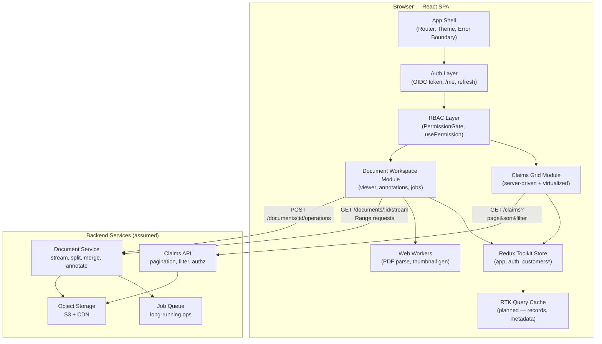
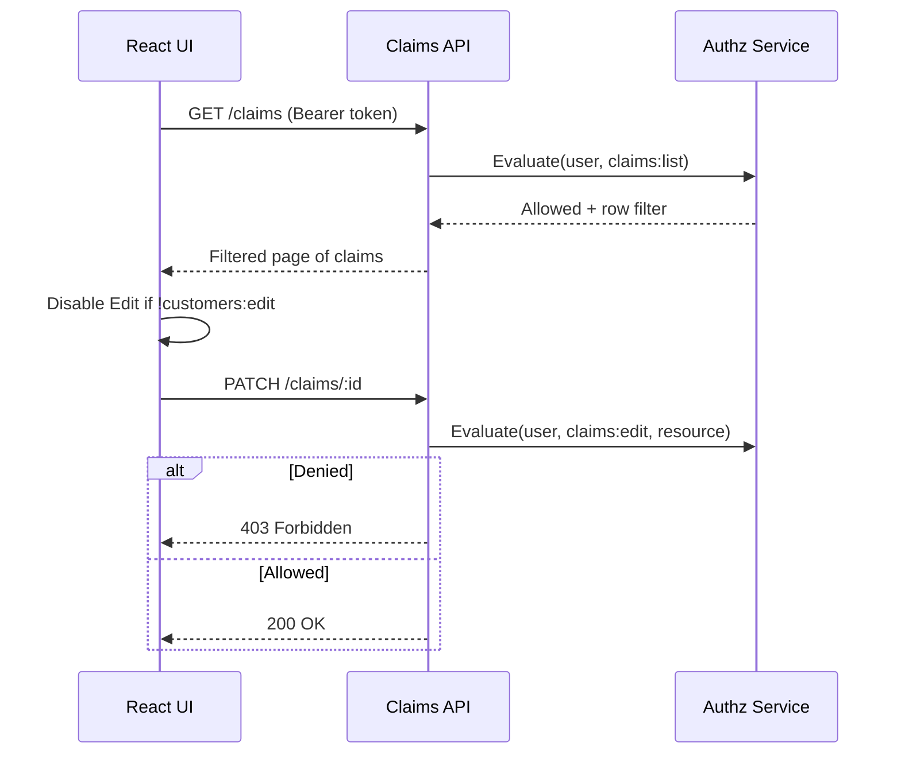
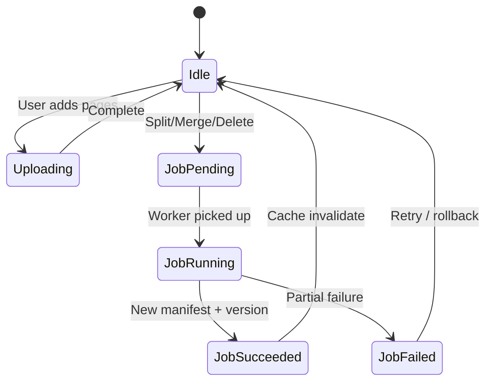
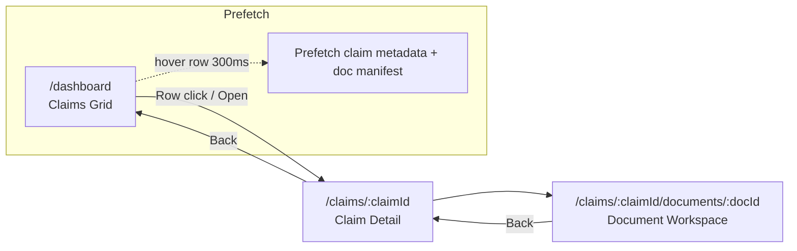
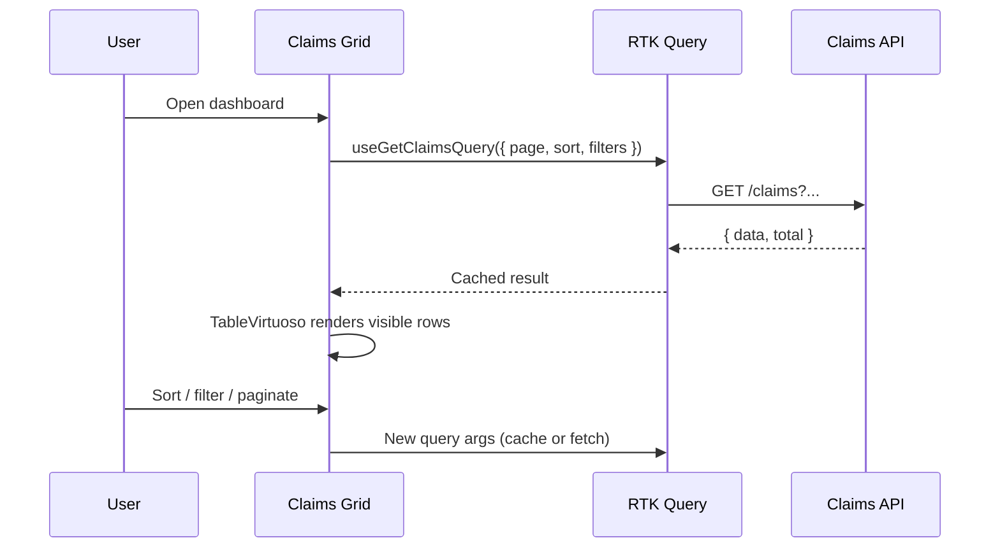
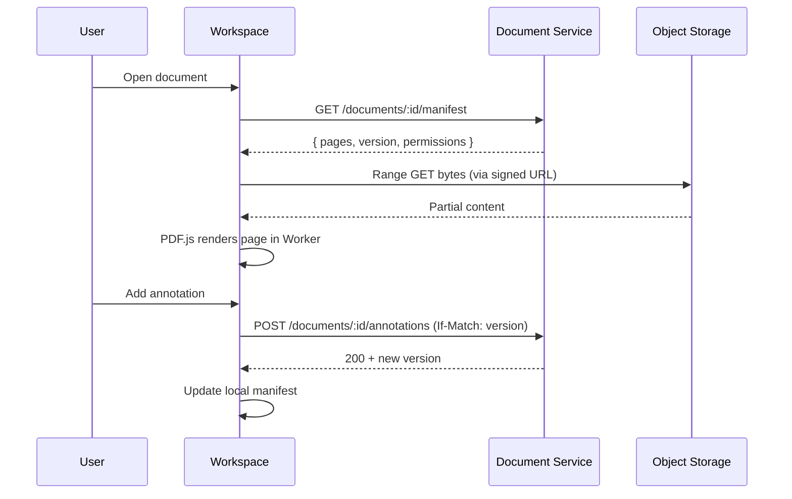
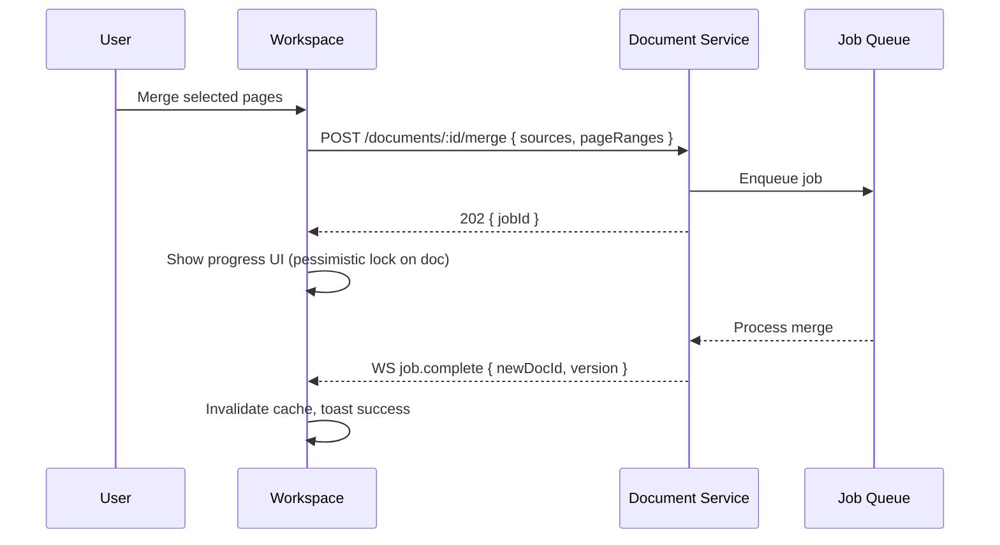

# High-Level Design (HLD)

> **Domain mapping:** Requirements refer to **claims**; the current case-study codebase implements the same patterns under **customers** (Figma CRM dashboard). The table in [§11 Frontend Module Map](#11-frontend-module-map) maps HLD layers to actual paths.

## 1. High-Level Architecture



`*` **customers** = claims grid state in the current codebase (`customersSlice`); backend APIs retain the `claims` namespace.

### 1.1 Component Boundaries

| Layer                  | Responsibility                                         | Does NOT                            |
| ---------------------- | ------------------------------------------------------ | ----------------------------------- |
| **App Shell**          | Routing, layout, global providers, error recovery      | Business logic                      |
| **Auth Layer**         | Token lifecycle, session, `/me` hydration              | Permission decisions on data        |
| **RBAC Layer**         | Show/hide/disable UI by permission                     | Authorize API calls (backend does)  |
| **Claims Grid**        | List UX, filters, row actions, navigation to workspace | Load full documents                 |
| **Document Workspace** | Viewer, annotations, split/merge UX, progress          | Persist without server confirmation |
| **Redux + RTK Query**  | Client state, server cache, optimistic job tracking    | Replace server validation           |
| **Web Workers**        | CPU-heavy PDF work off main thread                     | DOM rendering                       |

---

## 2. Technology Choices & Justification

### 2.1 Core UI Stack (existing — retained)

| Choice            | Library                   | Justification                                                                                                                                |
| ----------------- | ------------------------- | -------------------------------------------------------------------------------------------------------------------------------------------- |
| UI framework      | **React 19**              | Component model fits complex grid + workspace; ecosystem for virtualization and PDF tooling; team familiarity.                               |
| Component library | **Material UI 9**         | Aligns with company UX/UI standards and Figma CRM dashboard patterns; accessible primitives (DataGrid-adjacent patterns, dialogs, progress). |
| Styling           | **Emotion (MUI default)** | Co-located styles, theme tokens from Figma, no extra CSS-in-JS runtime beyond MUI.                                                           |
| Build             | **Vite 8**                | Fast HMR for large SPA; code-splitting for workspace chunk; native ESM.                                                                      |
| Routing           | **React Router 7**        | Deep-linkable claim rows (`/claims/:id/documents/:docId`); lazy-loaded workspace route reduces initial bundle.                               |

### 2.2 State Management

| Choice         | Library                   | Justification                                                                                                                                                                                                                           |
| -------------- | ------------------------- | --------------------------------------------------------------------------------------------------------------------------------------------------------------------------------------------------------------------------------------- |
| Global state   | **Redux Toolkit**         | Already in codebase; predictable state for auth, filters, workspace context; DevTools for debugging claim flows.                                                                                                                        |
| Server cache   | **RTK Query** (add-on)    | Built into RTK; deduplicates claim list fetches; tag-based invalidation after edit/delete; supports prefetch on row hover. **Why not React Query alone?** RTK Query integrates with existing slices and avoids a second cache paradigm. |
| Local UI state | **useState / useReducer** | Ephemeral grid filters, panel toggles — no need for Redux.                                                                                                                                                                              |

### 2.3 Claims Grid — 20,000+ Records

| Choice               | Approach                                   | Justification                                                                                                                                                     |
| -------------------- | ------------------------------------------ | ----------------------------------------------------------------------------------------------------------------------------------------------------------------- |
| Data loading         | **Server-side pagination + sort + filter** | 20k rows × ~1 KB metadata ≈ 20 MB JSON if loaded at once — unacceptable memory and TTFB. Server returns page of 50–100 rows + total count.                        |
| Rendering            | **react-virtuoso (`TableVirtuoso`)**       | Already integrated; renders only visible DOM rows (~15–20), keeping memory and layout cost flat regardless of page size. Handles sticky headers with MUI `Table`. |
| Pagination UX        | **MUI Pagination + page size selector**    | Explicit page boundaries aid audit/compliance workflows (insurance). User knows "page 47 of 400". **Not infinite scroll as primary** — see §7.                    |
| Optional enhancement | **MUI X DataGrid Pro**                     | If Figma requires built-in column resize, grouping, export — evaluate license vs custom `TableVirtuoso`. Current implementation favors control and bundle size.   |

**Target query contract:**

```
GET /api/v1/claims?page=1&pageSize=50&sort=createdAt:desc&status=open&assignee=me
Authorization: Bearer <token>

Response: { data: Claim[], total: 21453, page: 1, pageSize: 50 }
```

Server applies RBAC — client never receives rows the user cannot see.

### 2.4 RBAC

| Choice               | Approach                                                | Justification                                                                                                   |
| -------------------- | ------------------------------------------------------- | --------------------------------------------------------------------------------------------------------------- |
| Permission model     | **Resource:action strings** (e.g. `customers:edit`)     | Defined in `features/auth/authorization.ts`; production API may use `claims:*` — same RBAC pattern.             |
| Frontend enforcement | **`PermissionGate`, `usePermission`, disabled actions** | UX only — hide sidebar items, columns, action buttons.                                                          |
| Backend enforcement  | **API gateway + service-level authz**                   | **Source of truth.** Every mutating endpoint validates JWT + permissions + row-level scope (assignee, region).  |
| Row-level visibility | **Server-filtered queries**                             | `visibleTo` on records is a demo pattern; production uses server-side policy engine (OPA, custom RBAC service). |



### 2.5 Large Document Viewing (150 MB–1 GB)

| Choice           | Library / Pattern                                 | Justification                                                                                                                                    |
| ---------------- | ------------------------------------------------- | ------------------------------------------------------------------------------------------------------------------------------------------------ |
| Viewer engine    | **PDF.js (Mozilla)**                              | Industry standard for in-browser PDF; supports range requests, text layer, annotation hooks. Apache 2.0 license.                                 |
| Loading strategy | **HTTP Range requests + progressive page render** | Never download 1 GB into memory. Backend serves `Accept-Ranges: bytes`; PDF.js fetches page cross-references first, then page objects on demand. |
| Initial UX       | **Thumbnail strip + first page priority**         | Show page 1 within ~1–2 s; lazy-load adjacent pages. Skeleton + byte progress bar during index parse.                                            |
| Non-PDF          | **Server-side conversion to PDF tiles**           | TIFF/email attachments converted server-side; client always streams PDF or image tiles.                                                          |
| CPU isolation    | **Web Workers (pdf.js worker + custom)**          | Page parsing and thumbnail generation off main thread — keeps grid scroll at 60 fps when workspace is open in split view.                        |
| Caching          | **IndexedDB (metadata + rendered page cache)**    | Cache parsed page bitmaps for back-navigation; LRU cap (~200 MB) to bound memory. Evict on tab close.                                            |

**Why not embed native `<iframe>` or full-file blob URL?**  
A 1 GB blob exhausts mobile/desktop memory and blocks the main thread during parse. Streaming + page-level fetch is the only viable browser pattern.

**Why not client-side split/merge for 1 GB files?**  
Split/merge on 1 GB in-browser risks tab crash and non-recoverable state. **Server-side jobs** with client progress polling (see §4).

### 2.6 Document Operations

| Operation                      | Where executed                | Pattern                                                    |
| ------------------------------ | ----------------------------- | ---------------------------------------------------------- |
| View / scroll / zoom           | Client (PDF.js)               | Range streaming                                            |
| Page comments & annotations    | Client draft → server persist | Optimistic UI with version vector                          |
| Split / merge / delete         | **Server (async job)**        | POST → `jobId` → WebSocket or poll → refresh manifest      |
| Edit (page reorder, redaction) | Server                        | Same job pattern; client shows preview of pending manifest |



### 2.7 HTTP & Real-Time

| Choice            | Library              | Justification                                                                                                        |
| ----------------- | -------------------- | -------------------------------------------------------------------------------------------------------------------- |
| HTTP client       | **Axios**            | Already configured with interceptors (auth, global error toast); supports upload progress callbacks for large files. |
| Long-running jobs | **WebSocket or SSE** | Push job % complete; avoids aggressive polling on 30–120 s merge jobs. Fallback: exponential backoff poll.           |

---

## 3. Application Routes & Navigation Flow



### Grid → Workspace Transition (UX pattern)

1. **Immediate:** Slide-over panel or route push with skeleton workspace; breadcrumb preserves grid filter state in URL query (`?page=3&status=open`).
2. **Prefetch:** On row hover (debounced 300 ms), fetch document manifest (page count, sizes, permissions) — not the blob.
3. **Progressive load:** Render toolbar + thumbnail strip from manifest; stream page 1 via range request.
4. **Persist grid state:** Redux `customersSlice` retains list state today; filters/page move to RTK Query cache when server pagination lands.

This avoids a jarring full-page blank while a 800 MB file "loads."

---

## 4. Data Flow

### 4.1 Claims Grid Load



### 4.2 Document Open & Annotate



### 4.3 Split / Merge (Reliability)



**Partial failure handling:** Job response includes `failedPages[]` and `rollbackVersion`. UI offers retry on failed subset or full rollback — document never left in half-merged state without explicit user acknowledgment.

---

## 5. Performance Strategy

### 5.1 Grid (20k+ records)

| Technique                             | Purpose                                      |
| ------------------------------------- | -------------------------------------------- |
| Server-side pagination/sort/filter    | Bounded payload (~50 KB/page vs 20 MB)       |
| `TableVirtuoso` virtualization        | O(visible rows) DOM nodes                    |
| Memoized row renderers (`React.memo`) | Prevent re-render on unrelated state changes |
| Stable column definitions             | Avoid header thrash                          |
| RTK Query `keepUnusedDataFor`         | Instant back-navigation                      |
| Debounced search (300 ms)             | Reduce API churn                             |

### 5.2 Documents (150 MB–1 GB)

| Technique                           | Purpose                                                                            |
| ----------------------------------- | ---------------------------------------------------------------------------------- |
| Range/streaming                     | Constant memory vs file size                                                       |
| Web Workers                         | Non-blocking UI during parse                                                       |
| Page-level lazy load                | Only fetch visible ± buffer pages                                                  |
| IndexedDB LRU cache                 | Fast revisit, capped footprint                                                     |
| Code-split workspace route          | `React.lazy(() => import('./DocumentWorkspace'))` — ~PDF.js chunk not on dashboard |
| `OffscreenCanvas` (where supported) | Faster thumbnail rendering                                                         |

### 5.3 Re-render Minimization

- Selectors from Redux with shallow equality; colocate workspace state in a planned `documentsSlice`.
- Annotation layer as separate React subtree keyed by `pageNumber` so scroll doesn't remount entire workspace.
- Avoid storing raw PDF bytes in Redux — only metadata and UI flags.

---

## 6. Scalability

| Dimension        | Strategy                                                                  |
| ---------------- | ------------------------------------------------------------------------- |
| Record volume    | Server pagination; optional OpenSearch/Elastic for full-text claim search |
| Document size    | Object storage + CDN; no API body limits on blob path                     |
| Concurrent users | Stateless SPA; CDN for static assets; API horizontal scale                |
| Concurrent edits | Optimistic locking (`ETag` / `version` on manifest)                       |
| Long jobs        | Queue workers scale independently (K8s HPA on job consumers)              |

---

## 7. Trade-offs

### 7.1 Pagination vs Infinite Scroll vs Virtualization

| Approach              | Pros                                                | Cons                                                                               | Decision                                                           |
| --------------------- | --------------------------------------------------- | ---------------------------------------------------------------------------------- | ------------------------------------------------------------------ |
| **Server pagination** | Predictable memory, audit-friendly, works with 20k+ | Extra clicks                                                                       | **Primary**                                                        |
| **Virtualization**    | Smooth scroll within a page                         | All loaded rows still in memory if client-side                                     | **Within page** via Virtuoso                                       |
| **Infinite scroll**   | Feels seamless                                      | Hard to jump to page 200; breaks browser scroll restore; poor for compliance audit | **Reject as primary**; optional "load more" within filtered subset |

**Chosen hybrid:** Server pagination (50–100 rows/page) + `TableVirtuoso` for DOM efficiency. Best of compliance UX and performance.

### 7.2 Client vs Server Processing

| Operation              | Client     | Server      | Rationale                                    |
| ---------------------- | ---------- | ----------- | -------------------------------------------- |
| Filter/sort 20k claims | ✗          | ✓           | Correctness + RBAC at source                 |
| Render PDF pages       | ✓          | ✗           | Latency; server tile cost at scale           |
| Split/merge 1 GB PDF   | ✗          | ✓           | Memory, reliability, resumability            |
| Annotation overlay     | ✓ (render) | ✓ (persist) | Responsive ink; server stores canonical JSON |

### 7.3 Optimistic vs Pessimistic Updates

| Action               | Strategy                      | Why                                                       |
| -------------------- | ----------------------------- | --------------------------------------------------------- |
| Edit claim field     | Optimistic + rollback         | Low conflict, fast feedback                               |
| Delete claim         | Pessimistic confirm dialog    | Irreversible                                              |
| Assign claim         | Optimistic                    | Easy rollback                                             |
| Split/merge document | **Pessimistic** (job lock)    | Consistency critical; show progress until server confirms |
| Annotations          | Optimistic with version retry | Good UX; `409 Conflict` → refresh + merge                 |

### 7.4 Caching

| Cache                      | TTL / Size                  | Invalidation                 |
| -------------------------- | --------------------------- | ---------------------------- |
| RTK Query claims           | 60 s stale-while-revalidate | Tag invalidation on mutation |
| Document manifest          | Short (30 s)                | Version mismatch on write    |
| Rendered pages (IndexedDB) | LRU 200 MB                  | Doc version change           |

---

## 8. UX — Loading, Errors, Cancel/Retry

| Scenario          | UX Pattern                                                                |
| ----------------- | ------------------------------------------------------------------------- |
| Grid initial load | Skeleton rows + `CircularProgress` (existing pattern)                     |
| Document open     | Progress: "Loading document index… 12%" with cancel                       |
| Long merge job    | Determinate progress bar + "Cancel job" (server abort)                    |
| Network error     | Toast + inline retry; preserve grid filters in URL                        |
| 403 on action     | Toast "You don't have permission" — button already disabled when possible |
| Stale document    | Banner: "Updated by another user — refresh to see latest"                 |

---

## 9. Security Summary

- **Authentication:** OIDC → JWT stored in memory (or httpOnly cookie via BFF if required by security team).
- **Authorization:** Backend enforces all mutations; frontend mirrors for UX only.
- **Documents:** Short-lived signed URLs; no permanent blob URLs in client.
- **Annotations:** Sanitize user content; CSP restricts script injection in rendered HTML emails converted to PDF.

---

## 10. Backend API Assumptions (Minimal Contract)

```
# Claims
GET    /api/v1/claims?page&pageSize&sort&filter*
GET    /api/v1/claims/:id
PATCH  /api/v1/claims/:id
DELETE /api/v1/claims/:id
POST   /api/v1/claims/:id/assign

# Documents
GET    /api/v1/claims/:claimId/documents
GET    /api/v1/documents/:id/manifest
GET    /api/v1/documents/:id/stream          # Accept-Ranges
POST   /api/v1/documents/:id/annotations
POST   /api/v1/documents/:id/split|merge|delete
GET    /api/v1/jobs/:jobId
WS     /api/v1/jobs/subscribe

# Auth
GET    /api/v1/me                              # { id, role, permissions[] }
```

---

## 11. Frontend Module Map

### 11.1 Domain terminology

| HLD / requirements       | Current codebase                        | Notes                                          |
| ------------------------ | --------------------------------------- | ---------------------------------------------- |
| Claims record            | `Customer` (`app.constants.ts`)         | Same grid + row-action patterns                |
| Claims grid module       | `CustomersTable` + `DashboardContainer` | Client-side filter/sort/page today             |
| Claims list state        | `features/customers/customersSlice.ts`  | Redux key: `customers`                         |
| Claims data fetch        | `services/customer.service.ts`          | Mock: `public/customers.json`                  |
| Permission `claims:edit` | `customers:edit`                        | `features/auth/authorization.ts`               |
| Claims API (target)      | —                                       | `GET /api/v1/claims?page&…` replaces mock JSON |

### 11.2 HLD layer → source path

| HLD layer                | Status      | Path(s)                                                                                                                                           |
| ------------------------ | ----------- | ------------------------------------------------------------------------------------------------------------------------------------------------- |
| **App Shell**            | Implemented | `main.tsx`, `App.tsx`, `providers/AppProviders.tsx`, `components/common/ErrorFallback.tsx`                                                        |
| **Auth Layer**           | Demo only   | `features/auth/authSlice.ts` — replace with OIDC + `/me`                                                                                          |
| **RBAC Layer**           | Implemented | `features/auth/authorization.ts`, `hooks/usePermission.ts`, `components/common/PermissionGate.tsx`, `RoleSelector.tsx`, `Sidebar.tsx`             |
| **Claims Grid**          | Implemented | `containers/DashboardContainer.tsx`, `components/common/CustomersTable.tsx`, `features/customers/customersSlice.ts`, `constants/app.constants.ts` |
| **Document Workspace**   | Planned     | —                                                                                                                                                 |
| **Redux Store**          | Implemented | `store/store.ts` (`app`, `auth`, `customers`), `store/hooks.ts`                                                                                   |
| **RTK Query cache**      | Planned     | e.g. `features/customers/customersApi.ts`                                                                                                         |
| **HTTP client**          | Implemented | `services/axiosInstance.ts`, `services/customer.service.ts`, `services/toast.service.ts`                                                          |
| **Theme / UX standards** | Implemented | `theme/appTheme.ts`, MUI components in `components/common/`                                                                                       |
| **Web Workers**          | Planned     | `workers/pdfRender.worker.ts`                                                                                                                     |

### 11.3 Current `src/` tree

```
src/
├── main.tsx
├── App.tsx
├── containers/
│   └── DashboardContainer.tsx
├── components/common/
│   ├── CustomersTable.tsx
│   ├── PermissionGate.tsx
│   ├── RoleSelector.tsx
│   ├── Sidebar.tsx
│   ├── MetricCard.tsx
│   ├── ToastProvider.tsx
│   └── ErrorFallback.tsx
├── features/
│   ├── app/appSlice.ts
│   ├── auth/
│   │   ├── authSlice.ts
│   │   └── authorization.ts
│   └── customers/customersSlice.ts
├── services/
│   ├── axiosInstance.ts
│   ├── customer.service.ts
│   └── toast.service.ts
├── store/
│   ├── store.ts
│   └── hooks.ts
├── hooks/usePermission.ts
├── constants/app.constants.ts
├── theme/appTheme.ts
└── docs/design/
    ├── README.md
    └── HLD.md
```

### 11.4 Planned additions (document workspace phase)

```
src/
├── containers/DocumentWorkspaceContainer.tsx
├── components/documents/              # PdfViewer, ThumbnailStrip, AnnotationLayer
├── features/documents/                  # documentsSlice, job tracking
├── workers/pdfRender.worker.ts
└── services/document.service.ts
```

---

## 12. Implementation Phases

| Phase  | Deliverable                                                                                              |
| ------ | -------------------------------------------------------------------------------------------------------- |
| **P1** | Server-driven grid (paginated API), RBAC wired to `/me`; evolve `customersSlice` + `customer.service.ts` |
| **P2** | Row → workspace routing, manifest fetch, PDF.js streaming viewer                                         |
| **P2** | Annotations + comments with version conflict handling                                                    |
| **P3** | Split/merge/delete via job queue + progress UI                                                           |
| **P4** | IndexedDB cache, prefetch-on-hover, performance hardening                                                |

---

## 13. Summary of Key Decisions

1. **Server-side pagination + Virtuoso virtualization** — scales to 20k+ without loading full dataset or DOM.
2. **PDF.js + range streaming + Web Workers** — only viable approach for 150 MB–1 GB in-browser viewing without OOM.
3. **Server-side async jobs for split/merge** — reliability and consistency over client-side file manipulation.
4. **Redux Toolkit + RTK Query** — unified state/cache aligned with current codebase.
5. **Backend as authz source of truth; frontend for UX** — defense in depth for insurance compliance.
6. **Pessimistic updates for document mutations; optimistic for lightweight claim edits** — balances perceived speed with data integrity.

---

## References

- [Repository structure](./README.md)
- [Mozilla PDF.js](https://mozilla.github.io/pdf.js/)
- [react-virtuoso — TableVirtuoso](https://virtuoso.dev/)
- [RTK Query overview](https://redux-toolkit.js.org/rtk-query/overview)
